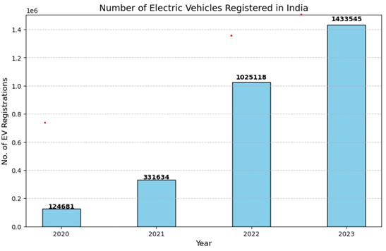

#  EV Market Segmentation & Entry Strategy

A data-driven project to identify the most viable market entry strategy for an EV startup in India using real-world datasets, clustering, and business analysis.

---

##  Objective

To determine:
- The most feasible EV category (2W, 3W, 4W, commercial)
- Target customer segment based on behavior and affordability
- High-potential geographic markets for launch

---

## Key Insight (TL;DR)

👉 Recommended strategy:
- **Product:** Electric 2-Wheelers (2W)  
- **Target:** Urban budget-conscious commuters (age 20–40)  
- **Market:** Delhi NCR, Bengaluru, Pune, Hyderabad  
- **Opportunity:** ₹300 Cr potential from ~100K early adopters  

---

##  Market Trends

 

 <b>EV Growth</b>

- EV adoption in India has grown rapidly in recent years  
- 2W and 3W segments show the strongest growth trends  
- Indicates strong demand for affordable urban mobility  

---

## 🚗 Vehicle Insights

- **2W segment leads with 850K+ sales (2023)**  
- 3W shows consistent growth in commercial use  
- 4W adoption limited due to high cost and infrastructure needs  

👉 **Conclusion:** 2W is the most scalable and accessible entry segment  

---

## 👥 Customer Insights

- Income has strong correlation with EV purchase (~0.95)  
- Active buyers: working professionals & urban commuters  
- Key segment: **low to mid-income users seeking cost-efficient transport**

---

## 🌍 Geographic Insights

- Top adoption states: Uttar Pradesh, Maharashtra, Karnataka, Delhi  
- Metro cities show highest readiness due to infrastructure and incentives  

---

## 🔌 Infrastructure Insights

- Delhi, Maharashtra, Karnataka lead in charging station availability  
- Strong infrastructure supports EV adoption in urban regions  

---

## 🤖 Segmentation Approach

- Applied **K-Means clustering + PCA**  
- Identified 3 segments:
  - Budget EV users (₹2.75L avg, ~120 km range)
  - Mid-range EV users
  - Premium EV buyers  

👉 **Target Segment:** Budget-conscious urban commuters  

---

## 💡 Business Strategy (4Ps)

**Product**
- Electric scooters/mopeds for daily commute  
- ~120 km range, low maintenance  

**Price**
- ₹80K–₹1.5L after subsidies  
- EMI options + battery subscription model  

**Place**
- Focus: Delhi NCR, Bengaluru, Pune, Hyderabad  
- Online-first + dealership hybrid model  

**Promotion**
- Digital marketing (Instagram, YouTube)  
- Influencer collaborations  
- Sustainability-focused messaging  

---

## 📊 Market Opportunity

- Working population (20–40): ~10M  
- EV 2W users: ~2M  
- Early adopters (~5%): ~100K  

**Unit Economics:**
- Avg price: ₹1.2L  
- Cost: ₹90K  
- Profit/unit: ₹30K  

👉 **Estimated Profit: ₹300 Crore**

---

## 🛠️ Tech Stack

- Python (Pandas, NumPy)  
- Scikit-learn (K-Means, PCA)  
- Matplotlib, Seaborn  

---

## 📂 Project Structure

